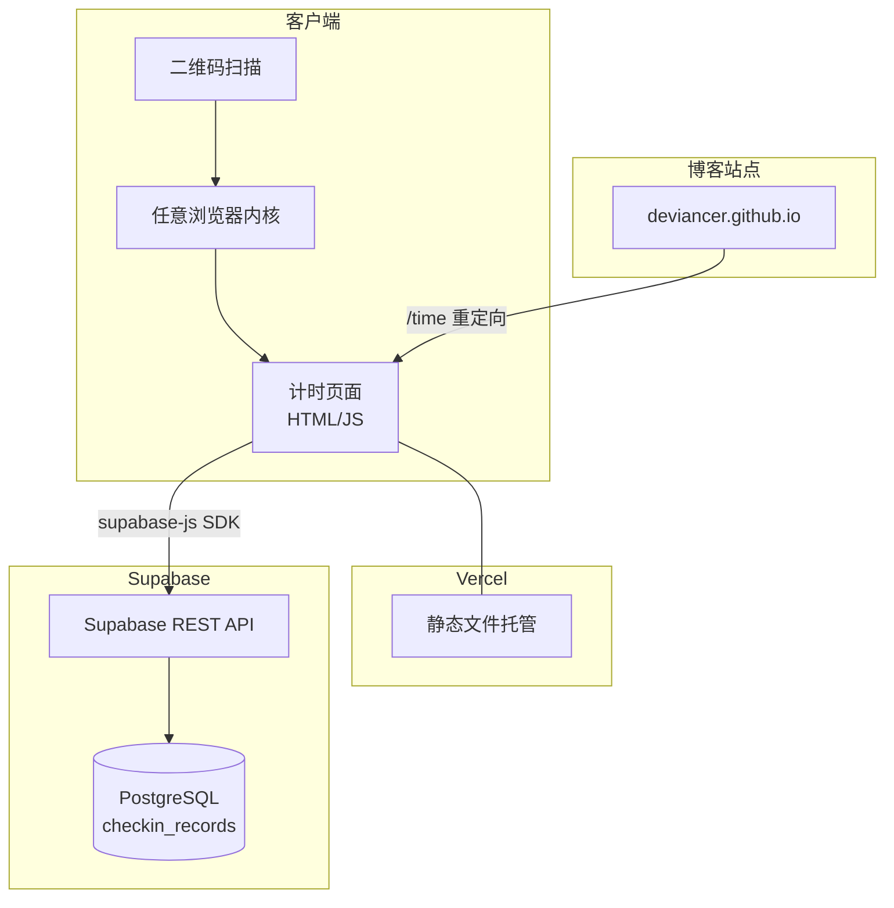
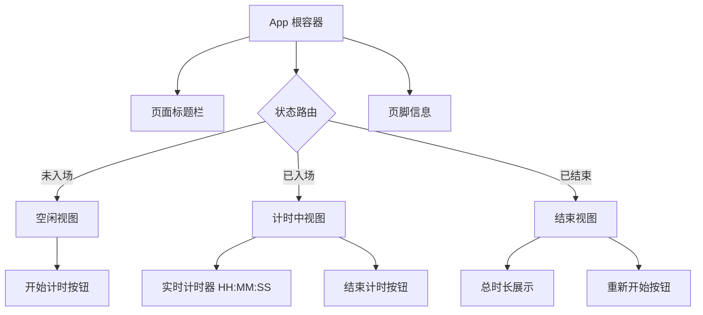
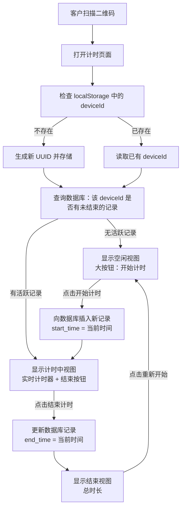
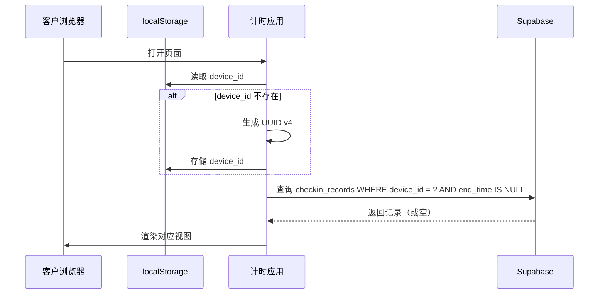
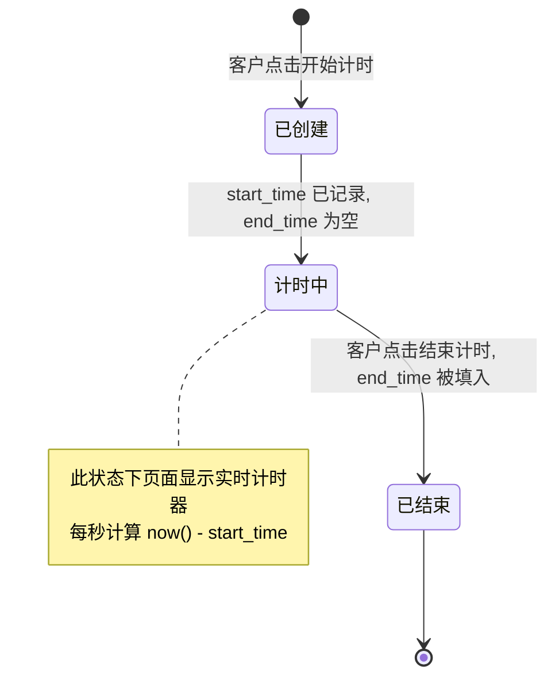

# 跨平台扫码计时系统 设计文档

## 1. 概述

### 1.1 业务背景

店主经营小店，需要一套自助计时系统，让客户通过扫描二维码即可记录到店时长。系统需要支持任意 App（微信、支付宝、浏览器等）扫码访问，并在同一设备上识别为同一客户。

### 1.2 核心目标

| 目标 | 描述 |
|------|------|
| 跨平台兼容 | 任何 App 扫码均可打开并使用 |
| 自助计时 | 客户无需店员协助，自行开始/结束计时 |
| 设备识别 | 同一设备多次访问能识别为同一客户 |
| 极简体验 | 移动端优先，操作步骤最少化 |

### 1.3 技术选型

| 层级 | 技术方案 | 选型理由 |
|------|----------|----------|
| 前端 | 原生 HTML / JS | 无构建步骤，加载极快，兼容所有浏览器内核 |
| 数据库 | Supabase (PostgreSQL) | 提供 REST API，前端可直接调用，免运维 |
| 托管 | Vercel | 免费静态托管，全球 CDN，支持自定义域名 |
| 样式 | 内联 CSS（匹配博客暗色主题） | 与现有博客视觉风格统一 |

---

## 2. 系统架构

### 2.1 整体架构



### 2.2 部署架构

系统由两个独立部分组成：

| 部分 | 托管平台 | 域名 | 说明 |
|------|----------|------|------|
| 计时应用 | Vercel | 自定义域名（如 `time.deviancer.io`）或 Vercel 分配域名 | 独立的单页应用 |
| 博客跳转页 | GitHub Pages | `deviancer.github.io/time` | Jekyll 页面，自动重定向到 Vercel 应用 |

> **域名方案说明**：由于 GitHub Pages 不支持将子路径代理到外部服务，`deviancer.github.io/time` 路径下放置一个跳转页面，自动将用户重定向到 Vercel 上的计时应用。二维码可直接指向 Vercel 应用地址，省去跳转。

---

## 3. 组件架构

### 3.1 页面组件层级



### 3.2 组件职责

| 组件 | 职责 | 交互 |
|------|------|------|
| App 根容器 | 初始化设备 ID，查询当前状态，管理全局状态 | 页面加载时自动执行 |
| 页面标题栏 | 显示店铺名称和系统标题 | 纯展示 |
| 空闲视图 | 显示大尺寸"开始计时"按钮 | 点击后调用开始计时接口 |
| 计时中视图 | 显示实时跳动的计时器 + "结束计时"按钮 | 每秒刷新显示，点击结束调用接口 |
| 结束视图 | 显示本次总时长 + "重新开始"按钮 | 点击重新开始回到空闲视图 |

### 3.3 状态管理

系统使用轻量级的内存变量管理状态，无需引入状态管理库。

| 状态变量 | 类型 | 来源 | 说明 |
|----------|------|------|------|
| deviceId | String (UUID) | localStorage | 设备唯一标识，首次访问时生成 |
| currentStatus | Enum: idle / active / done | 运行时计算 | 当前页面状态 |
| activeRecord | Object | Supabase 查询 | 当前活跃的签到记录 |
| elapsedSeconds | Number | 定时器计算 | 已计时秒数 |
| totalDuration | String | 计算结果 | 结束后的总时长文本 |

---

## 4. 核心业务流程

### 4.1 完整用户流程



### 4.2 设备识别机制



**识别方案的局限性与应对：**

| 场景 | 影响 | 应对策略 |
|------|------|----------|
| 客户清除浏览器数据 | 丢失 deviceId，被视为新客户 | 可接受，小店场景下低频发生 |
| 客户使用隐私模式 | localStorage 不持久化 | 页面顶部提示"请使用普通模式访问" |
| 客户换设备扫码 | 新设备 = 新 deviceId | 可接受，一般客户到店使用同一手机 |
| 不同 App 扫码 | 不同 App 内置浏览器有独立 localStorage | 页面提示"请使用同一 App 扫码" |

### 4.3 计时器工作原理

计时器采用**服务端时间基准 + 客户端渲染**模式：

1. **开始计时时**：`start_time` 由数据库服务端的 `now()` 函数生成，确保时间准确
2. **计时显示时**：客户端根据 `start_time` 与本地当前时间的差值计算已过秒数
3. **刷新频率**：每 1 秒更新一次显示（使用 `setInterval`）
4. **结束计时时**：`end_time` 同样由数据库服务端生成
5. **页面刷新恢复**：重新打开页面时，从数据库读取 `start_time` 继续计时，不会中断

---

## 5. API 集成层

### 5.1 Supabase 客户端交互

所有数据操作通过 `supabase-js` SDK 直接在浏览器端完成，无需自建后端。

### 5.2 接口定义

#### 5.2.1 查询活跃记录

| 项目 | 内容 |
|------|------|
| 操作 | 查询 `checkin_records` 表 |
| 筛选条件 | `device_id` 等于当前设备 ID，且 `end_time` 为空 |
| 排序 | 按 `created_at` 降序 |
| 数量限制 | 取 1 条 |
| 返回 | 活跃记录对象，或空 |

#### 5.2.2 创建签到记录

| 项目 | 内容 |
|------|------|
| 操作 | 向 `checkin_records` 表插入一行 |
| 写入字段 | `device_id`（客户端传入）、`start_time`（数据库服务端当前时间） |
| 自动字段 | `id`（UUID 自动生成）、`created_at`（数据库默认值） |
| 返回 | 新插入的记录对象 |

#### 5.2.3 结束签到记录

| 项目 | 内容 |
|------|------|
| 操作 | 更新 `checkin_records` 表 |
| 匹配条件 | `id` 等于当前活跃记录的 ID |
| 更新字段 | `end_time`（数据库服务端当前时间） |
| 返回 | 更新后的记录对象 |

### 5.3 Supabase 安全策略

| 策略 | 规则 | 说明 |
|------|------|------|
| 匿名读取 | 允许查询自己 `device_id` 的记录 | 通过 RLS 策略限制 |
| 匿名插入 | 允许插入新记录 | `device_id` 由客户端提供 |
| 匿名更新 | 仅允许更新 `end_time` 字段 | 禁止修改 `start_time` 和 `device_id` |
| 禁止删除 | 任何角色都不允许删除记录 | 保留所有历史数据 |

> **RLS（Row Level Security）**：Supabase 的行级安全策略需要启用，确保每个客户端只能操作与自己 `device_id` 关联的记录。使用 `anon` 角色配合 RLS 策略，无需用户登录。

---

## 6. 数据模型

### 6.1 表结构：checkin_records

| 字段名 | 类型 | 约束 | 说明 |
|--------|------|------|------|
| id | UUID | 主键，自动生成 | 记录唯一标识 |
| device_id | VARCHAR(64) | NOT NULL，索引 | 客户设备唯一标识 |
| start_time | TIMESTAMP WITH TIME ZONE | NOT NULL | 入场时间（服务端生成） |
| end_time | TIMESTAMP WITH TIME ZONE | 可为空 | 离场时间（结束时更新） |
| created_at | TIMESTAMP WITH TIME ZONE | NOT NULL，默认当前时间 | 记录创建时间 |

### 6.2 索引策略

| 索引名 | 字段 | 类型 | 用途 |
|--------|------|------|------|
| idx_device_id | device_id | B-Tree | 加速按设备查询 |
| idx_device_active | device_id, end_time | 复合索引 | 加速查询"某设备的未结束记录" |

### 6.3 数据流转状态



---

## 7. 界面设计

### 7.1 设计原则

- **移动端优先**：按钮尺寸足够大，方便触控操作
- **暗色主题**：与博客主站视觉风格一致（背景色 `#0d1117`，文字色 `#c9d1d9`）
- **极简交互**：每个状态最多一个核心操作按钮
- **无需滚动**：所有内容在一屏内展示

### 7.2 三种视图状态

#### 空闲状态（未入场）

```
┌─────────────────────────┐
│       🕐 店铺计时系统      │
│                          │
│                          │
│    ┌──────────────────┐  │
│    │                  │  │
│    │   ⏱ 开始计时     │  │
│    │                  │  │
│    └──────────────────┘  │
│                          │
│    欢迎光临，点击开始计时   │
│                          │
└─────────────────────────┘
```

#### 计时中状态（已入场）

```
┌─────────────────────────┐
│       🕐 店铺计时系统      │
│                          │
│      已入场，正在计时...    │
│                          │
│     ┌───────────────┐    │
│     │  02 : 34 : 15 │    │
│     └───────────────┘    │
│                          │
│    ┌──────────────────┐  │
│    │   ⏹ 结束计时     │  │
│    └──────────────────┘  │
│                          │
│    入场时间：14:30:22     │
└─────────────────────────┘
```

#### 结束状态

```
┌─────────────────────────┐
│       🕐 店铺计时系统      │
│                          │
│        本次计时已结束      │
│                          │
│     ┌───────────────┐    │
│     │  总计 2小时34分  │    │
│     └───────────────┘    │
│                          │
│   入场：14:30  离场：17:04 │
│                          │
│    ┌──────────────────┐  │
│    │   🔄 重新开始     │  │
│    └──────────────────┘  │
└─────────────────────────┘
```

### 7.3 视觉规范

| 元素 | 样式参数 |
|------|----------|
| 页面背景 | `#0d1117`（与博客一致） |
| 卡片背景 | `#161b22`（与博客一致） |
| 主按钮（开始） | 圆角矩形，背景色 `#238636`（绿色），高度 60px |
| 警告按钮（结束） | 圆角矩形，背景色 `#da3633`（红色），高度 60px |
| 计时器数字 | 等宽字体 `JetBrains Mono`，字号 48px，颜色 `#58a6ff` |
| 边框 | `1px solid #30363d`（与博客一致） |
| 文字颜色 | 主文字 `#c9d1d9`，次要文字 `#8b949e` |

---

## 8. 路由与导航

### 8.1 路由结构

| 路径 | 所在平台 | 说明 |
|------|----------|------|
| `/time` (博客站) | GitHub Pages | Jekyll 页面，含自动跳转逻辑到 Vercel 应用 |
| `/` (Vercel 应用) | Vercel | 计时应用主页面（单页） |

### 8.2 博客集成方式

在 Jekyll 博客中新增一个 `time.html` 页面，该页面的唯一作用是将用户重定向到 Vercel 托管的计时应用。

页面行为：访问 `deviancer.github.io/time` 后，浏览器自动跳转到 Vercel 上的计时应用 URL。

> **替代方案**：如果二维码直接指向 Vercel 应用地址，则无需此跳转页面。

---

## 9. Vercel 托管与域名

### 9.1 项目结构

计时应用作为独立项目部署到 Vercel，目录结构如下：

| 文件/目录 | 用途 |
|-----------|------|
| `index.html` | 计时应用主页面（含所有 HTML 结构） |
| `style.css` | 样式文件（暗色主题） |
| `app.js` | 应用逻辑（设备识别、状态管理、Supabase 交互、计时器） |
| `vercel.json` | Vercel 部署配置（路由规则） |

### 9.2 Vercel 部署流程


1. 在 GitHub 上创建新仓库（如 `shop-timer`）
2. 将计时应用代码推送到该仓库
3. 在 Vercel 中导入该 GitHub 仓库
4. Vercel 自动检测为静态站点并部署
5. 配置自定义域名（可选）

### 9.3 域名绑定方案

| 方案 | 域名示例 | 配置方式 |
|------|----------|----------|
| 方案 A：使用 Vercel 默认域名 | `shop-timer.vercel.app` | 无需额外配置，部署即可用 |
| 方案 B：自定义子域名 | `time.deviancer.io`（需拥有 deviancer.io 域名） | 在 DNS 添加 CNAME 记录指向 Vercel |
| 方案 C：博客跳转 | `deviancer.github.io/time` → Vercel 应用 | 博客添加跳转页面 |

---

## 10. 测试策略

### 10.1 测试范围

| 测试类型 | 测试内容 | 方式 |
|----------|----------|------|
| 设备识别测试 | 首次访问生成 deviceId，再次访问复用 | 手动验证 localStorage |
| 计时流程测试 | 开始 → 计时中 → 结束，全流程走通 | 手动操作验证 |
| 状态恢复测试 | 计时中关闭页面，重新打开后恢复计时 | 手动验证 |
| 跨 App 测试 | 微信、支付宝、系统浏览器分别扫码 | 真机逐一验证 |
| 数据库验证 | Supabase 控制台检查记录是否正确写入 | 查看数据库记录 |
| 移动端适配 | 不同屏幕尺寸下布局是否正常 | 多设备/DevTools 模拟 |

### 10.2 关键测试场景

| 场景 | 预期行为 |
|------|----------|
| 首次扫码，点击开始计时 | 创建记录，页面切换到计时中视图 |
| 计时中刷新页面 | 自动恢复计时，不重新创建记录 |
| 计时中关闭后重新扫码 | 识别到活跃记录，继续显示计时 |
| 点击结束计时 | 记录 end_time，显示总时长 |
| 结束后再次访问 | 显示空闲视图（可重新开始） |
| 清除浏览器数据后访问 | 生成新 deviceId，显示空闲视图 |
