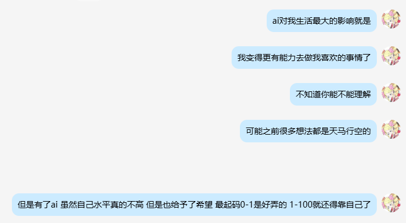
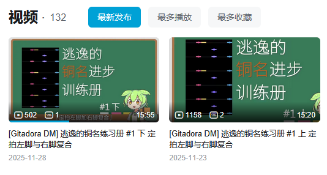
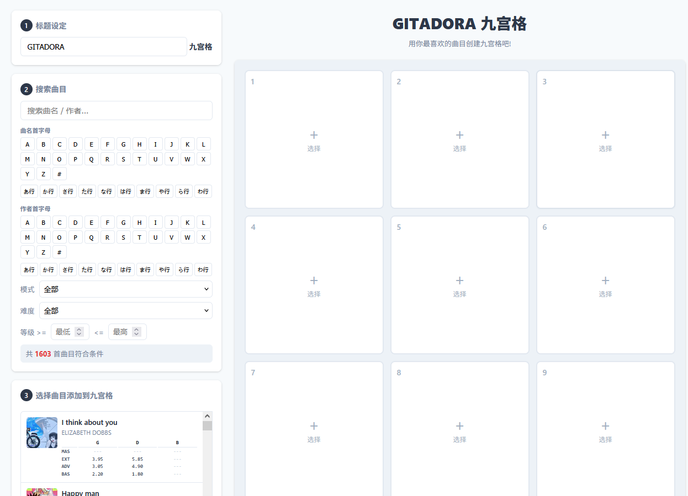

## 关于我

你好。我是**逃逸**，老家江苏南通，目前在江苏常州工作，截止到 2026.3.25，还没有被 AI 取代，很高兴。24 年的介绍 blog 一直没更新，现在更新一下吧。

> 本职是个开发工程师，实际上写代码的水平很垃圾，最起码横向对比朋友和前辈，我的水平依旧是很垃圾的那种。但是没办法，我也不想写代码，写代码只是为了生活而已。

---

## 博客的诞生

在 23 年末 24 年初，我在网络上看到了**松大**的 blog，我现在还记得当时的我被如此牛逼的人和这么帅的 blog 震惊到说不出话来。

除了感慨以外更觉得——这些人活的好有意思，包括宽哥的 blog 也是，帮了很多很多人。

> 那我是不是该做点什么？别找笑了，我能干什么？代码水平基于脑子发热程度，游戏水平更是路人级别，我能做什么好东西出来吗？

可惜我的弱智程度不支持我思考这么多，问了下我网络上的好前辈 0juju，请教了一下怎么最方便的搞一个 blog 出来，然后用 github 搞个静态网站，随便 fork 了一个看上去还行的页面布局，我的 blog 就诞生了！

后来在 25 年中，利用 AI，我对自己的界面修修改改，其实你现在也能看到很多 AI 残留的痕迹，对不起！那怎么办，我的审美你也知道。。。。。

---

## 25年末，人生开始有了色彩

我一直认为我的人生真的很无趣，但是你要说闪光点的话，我想，应该是从 25 年末左右，我的人生才开始变得稍微有点色彩了？

### 第一个视频

2025 年 11 月 23 日，我发布了第一个我自认为的攻略/能帮助别人的视频：

**[Gitadora DM] 逃逸的铜名练习册 #1 上 定拍左脚与右脚复合** 

这是一个**第二人称为主**的游戏技术攻略视频，或者说是记录视频。本意是不想——不想让自己被遗忘，不想让自己以后不知道自己这段时间多有努力。借助骏达萌这样会更可爱一点，哎呀我说毛豆精是对的你明白吗！

哪怕对于别人来说，铜名真的真的没那么难，但是对于自己来说，真的是拼劲全力，这么高强度打了 3、4 年，环境也比绝大部分人好，**虽然确实是菜的要死**，但是好歹也做到了。

> 我不希望以后哭的时候自己都找不到安慰自己的素材。草泥马！

但是既然做了，我也希望不仅仅能帮助自己，也希望能帮助到大家。那么就第二人称吧！第二人称有一种亲近感，这样既不会把视频内容做的太枯燥/教人做事，也能满足自己的小小愿望。

虽然但是，截止到更新的 26 年 3 月 25 日，我的第二个视频还没发，因为害怕！因为害怕！！！！别急，再拖一会~

---

## 借助 AI，我能做点什么了

也就是从这个时候开始，搭载了 AI 技术的我，真正意识到了——

> **做不了凤凰做个鸡还不行吗！温暖不了地球，温暖一朵花也行啊！**

你别说，ai是真牛逼，我真害怕自己会被ai淘汰，哈哈。

## 我的小工具

| 时间 | 项目 | 说明 |
|:---:|:---:|:---|
| 2026.3.18 | shop-timer 宝岛计时小工具 | 计时辅助工具 |
| 2026.3.24 | gitadora_nine_grid Gitadora九宫格 BINGO | 游戏辅助工具 |

andmore...
